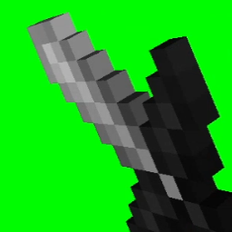

# Antimations

Safe and customizable mod to cancel various gameplay animations

## Dependencies

| **Environment** | **[OneConfig](https://polyfrost.org/projects/oneconfig)** v0/v1 |
|:---------------:|:---------------------------------------------------------------:|
|  Forge (1.8.9)  |                      Bundled (via tweaker)                      |
| Ornithe (1.8.9) |                  Required (separate download)                   |

## Features

Swing Customization

- Cancel Air Swings
- Cancel Entity Hit Swings
- Cancel Only Hurt Entity Swings
- Cancel Block Hit Swings
- Cancel Block Interact Swings
- Cancel Fishing Rod Swings
- Cancel Creeper Ignition Swings
- Cancel Other Player Swings

Item Reset

- Cancel Item Use Hand Resets
- Cancel Item Update Hand Resets
- Cancel All Hand Resets

Other

- Cancel Own Block Animations
- Cancel Third Person Block Animations
- Cancel Own Bow Animations
- Cancel Third Person Bow Animations
- Cancel Eating Animations
- Cancel Drinking Animations
- Cancel Own Limb Movements
- Cnacel Other Limb Movements

